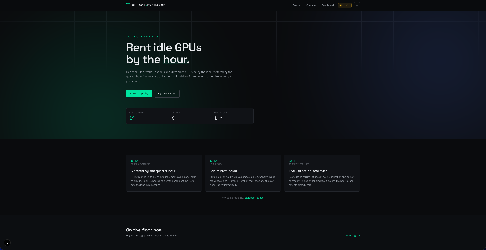
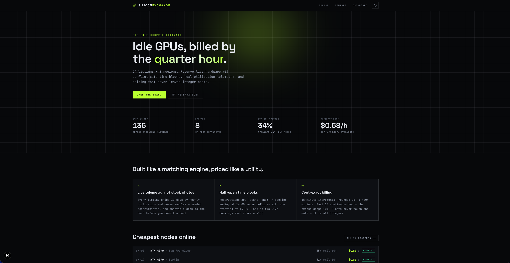
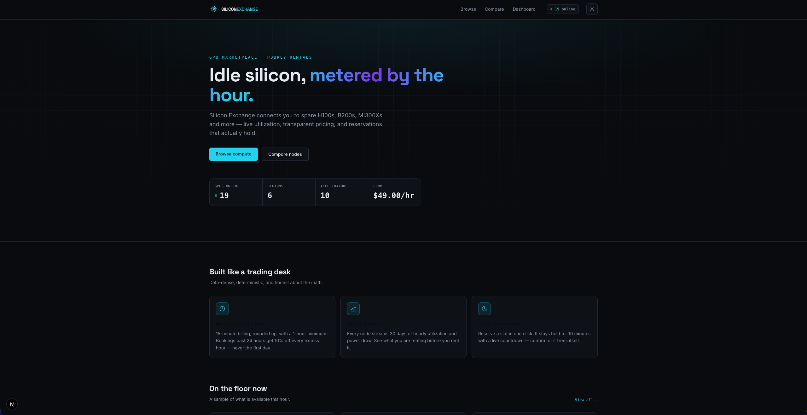

# Silicone Exchange

Three local models, one coding prompt, a dual Spark cluster.

After watching [@digitalix's video on cloud vs local](https://www.youtube.com/watch?v=ujs0_cpAnaw), I wanted to see what my dual Spark cluster could do with smaller models and OMP, with no custom plugins or tricks.

The task was to build **Silicon Exchange**, a fictional marketplace for renting GPUs and AI accelerators by the hour. Each model received the same prompt and produced its own Next.js app, complete with mock listings, booking logic, tests, and a distinct design.

## The runs

All three apps were one-shotted using OMP as the harness, with no custom plugins or tricks.

| Model | Recorded run time | Code and app documentation |
| --- | --- | --- |
| GLM 5.3 Flash | 1h 44m | [glm53-flash](./glm53-flash/) |
| Qwen 3.8 Flash Next | 1h 21m | [qwen-38-flash-next](./qwen-38-flash-next/) |
| Deepseek V4 Flash 0731 | 1h 10m | [deepseekv4-flash-0731](./deepseekv4-flash-0731/) |

These are my recorded times for the three runs. Alex's four Studio setup in the video inspired the comparison, but this repository does not establish a controlled hardware comparison or an independent quality ranking. Model quantization, inference settings, and token counts are not recorded here.

## Try an app

Use Node.js 24.x or 26.x and npm. Each directory is a standalone project with its own lockfile; run commands inside the app you want to try.

```bash
git clone https://github.com/ashhart/silicone-exchange.git
cd silicone-exchange/glm53-flash
npm ci
npm run dev
```

Open [localhost:3000](http://localhost:3000). Substitute `qwen-38-flash-next` or `deepseekv4-flash-0731` to try another model's output.

To run all three side by side, use a separate terminal for each app and choose distinct ports with `npm run dev -- --port 3001` and `npm run dev -- --port 3002` for the second and third apps. Separate ports also keep their browser storage isolated.

```bash
npm test          # Run the app's existing unit tests
npm run lint      # Check lint separately
npm run build     # Create a production build
npm start        # Serve the production build
```

Dependency installation and Google font downloads during development or builds require network access. No API keys, database, or backend setup is needed; the apps use mock data and save reservations in browser localStorage.

## The shared task

Read [Alex Ziskind's original prompt](https://gist.github.com/alexziskind1/fe55f03892f3fe1d6d8cf6065c631bb8). It is also preserved as `plan.md` in each app directory, and all three copies are identical. It asks for 24 GPU listings, seeded utilization charts, URL-based filters, a comparison page, and persistent reservations.

The booking rules include half-open time intervals, billing rounded up to 15 minutes with a one-hour minimum, a 10% discount on time beyond 24 hours, ten-minute reservation holds, and maintenance blocking new bookings. Each app contains its own implementation and tests, so the code is available to inspect alongside the visual results.

## Screenshots

### GLM 5.3 Flash



[All GLM screenshots](./glm53-flash/screenshots/)

### Qwen 3.8 Flash Next



[All Qwen screenshots](./qwen-38-flash-next/screenshots/)

### Deepseek V4 Flash 0731



[All Deepseek screenshots](./deepseekv4-flash-0731/screenshots/)
